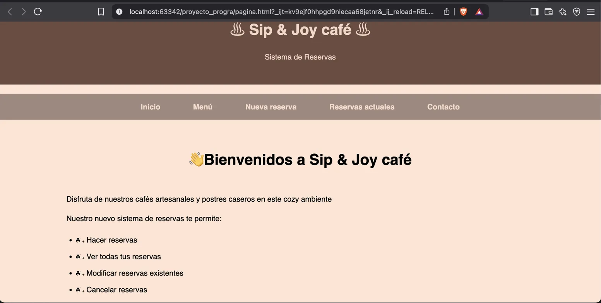
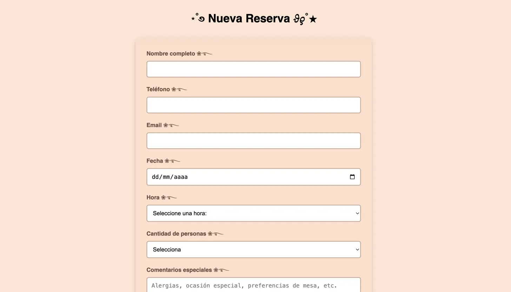
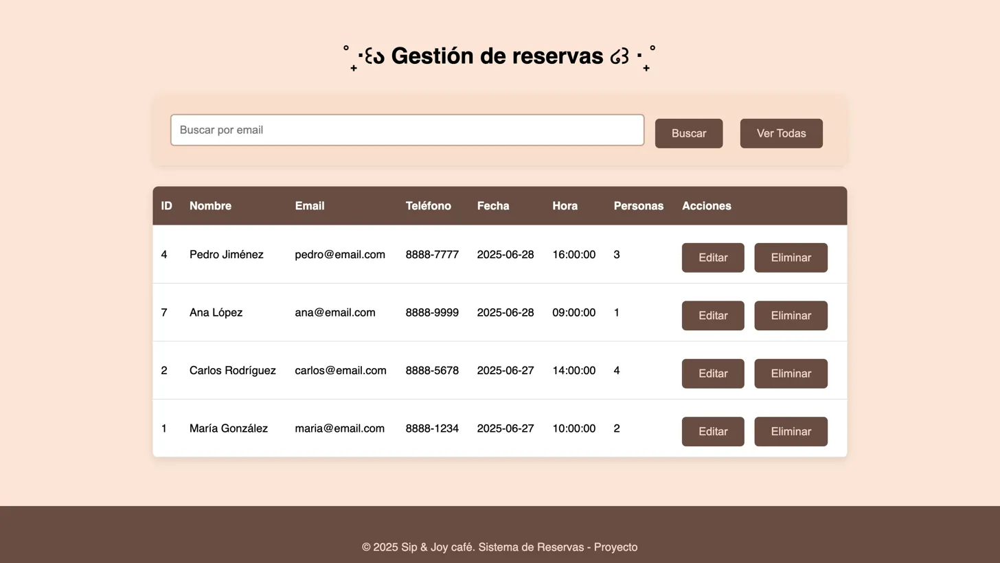

# Sistema de Reservas - Sip & Joy Café

## Integrantes del Grupo
- María Fernanda Moroney Sole
- Ariana Víquez
- Robson Calvo

## Descripción

Este proyecto es un sistema web para gestionar reservas del café "Sip & Joy". Los clientes pueden hacer reservas, ver sus reservas existentes, modificarlas y cancelarlas cuando sea necesario.

## Tecnologías

**Backend:**
- Python con FastAPI
- MySQL para la base de datos
- SQLAlchemy como ORM

**Frontend:**
- HTML, CSS y JavaScript
- Diseño responsive

## Estructura de Archivos

```
proyecto_progra/
├── main.py              # Servidor API
├── pagina.html          # Página web principal
├── estilo.css           # Estilos
├── script.js            # Funciones JavaScript
├── database.sql         # Script de base de datos
└── imagenes/            # Imágenes del proyecto
```

## Instalación

1. Instalar las dependencias de Python:
   ```
   pip install fastapi uvicorn sqlalchemy pymysql cryptography email-validator
   ```

2. Configurar MySQL:
   - Usuario: root
   - Contraseña: 123Queso.
   - Ejecutar el archivo database.sql

3. Ejecutar el servidor:
   ```
   uvicorn main:app --reload
   ```

4. Abrir en el navegador: http://127.0.0.1:8000/reservas

## Funcionalidades

El sistema permite:
- Crear nuevas reservas
- Ver todas las reservas
- Buscar reservas por email
- Editar reservas existentes
- Eliminar reservas

## API Endpoints

- `GET /reservas` - Obtener todas las reservas
- `POST /reservas` - Crear nueva reserva
- `GET /reservas/{id}` - Obtener reserva específica
- `PUT /reservas/{id}` - Actualizar reserva
- `DELETE /reservas/{id}` - Eliminar reserva
- `GET /reservas/buscar/{email}` - Buscar por email

## Base de Datos

La tabla `reservas` tiene estos campos:
- id (clave primaria)
- nombre
- telefono
- email
- fecha
- hora
- personas
- comentarios
- created_at

## Capturas de Pantalla

### Página Principal


La página principal muestra el header del café con navegación y las funcionalidades disponibles.

### Formulario de Nueva Reserva


Formulario completo con campos de nombre, teléfono, email, fecha, hora, número de personas y comentarios.

### Gestión de Reservas


Tabla que muestra todas las reservas con opciones para editar, eliminar y buscar por email.

## Problemas Encontrados

Durante el desarrollo tuvimos algunos problemas:

1. **Conexión a MySQL**: Al principio no podíamos conectar la API con la base de datos. Lo solucionamos revisando las credenciales y la configuración de SQLAlchemy.

2. **Validación de fechas**: Implementamos validación tanto en el frontend como en el backend para asegurar que las fechas sean correctas.

3. **Diseño responsive**: Tuvimos que ajustar los estilos CSS para que la página se vea bien en diferentes tamaños de pantalla.

## Mejoras Futuras

Si tuviéramos más tiempo, nos gustaría agregar:
- Sistema de login para usuarios
- Confirmación por email
- Disponibilidad de mesas en tiempo real
- Panel de administración más completo

## Conclusión

Este proyecto nos permitió aprender sobre desarrollo web full-stack. Combinamos un backend robusto con FastAPI y una interfaz de usuario amigable. El sistema funciona correctamente y cumple con todos los requisitos del proyecto.

Cada integrante del equipo contribuyó en diferentes aspectos: diseño de la base de datos, desarrollo del backend, creación del frontend y testing del sistema completo.